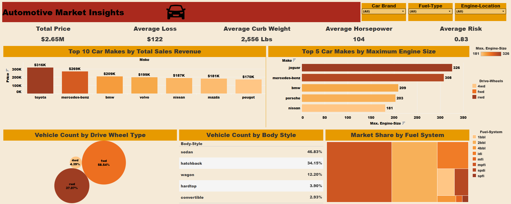

# Automotive Market Insights

## Project Overview
This project presents an interactive dashboard analyzing automotive market data to extract key business insights related to pricing, risk, vehicle specifications, and market distribution.

The dashboard helps understand market trends, brand performance, and vehicle characteristics using clear KPIs and visual analytics.

---

## Project Objectives
- Analyze total market pricing trends
- Compare car manufacturers based on sales revenue
- Identify brands with the largest engine sizes
- Study vehicle distribution by drive wheel type and body style
- Explore fuel system market share
- Provide quick KPIs for business decision-making

---

## Dashboard KPIs
The dashboard highlights key metrics:

- **Total Price Value:** $2.65M
- **Average Loss:** $122
- **Average Curb Weight:** 2,556 lbs
- **Average Horsepower:** 104 HP
- **Average Risk Rating:** 0.83

---

## Dashboard Insights
Key visual insights include:

### Top Car Makes by Total Revenue
Comparison of manufacturers generating the highest total sales value.

### Maximum Engine Size by Brand
Shows brands producing vehicles with the largest engines.

### Vehicle Distribution by Drive Wheel Type
Breakdown of FWD, RWD, and 4WD vehicles in the market.

### Vehicle Count by Body Style
Market share comparison between sedans, hatchbacks, wagons, and other body types.

### Fuel System Market Share
Visualization of fuel system distribution across vehicles.

---

## Tools & Technologies
- Tableau Public (Dashboard Creation)
- Excel / CSV Dataset
- Data Cleaning & Preparation
- Data Visualization & Business Analysis

---

---

## How to Use
1. Download or clone the repository
2. Open Tableau dashboard file
3. Explore filters and visualizations interactively

---

## Author
**Ibrahim Younis**  
Aspiring Data Analyst focused on Data Analysis & Visualization.

---

## Project Purpose
This project is part of my data analytics portfolio showcasing dashboard development and storytelling using automotive data.

